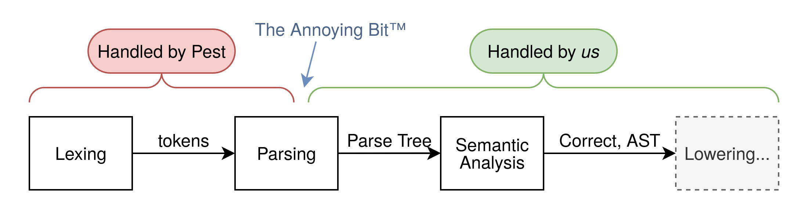

# Lang lang compiler

## General architecture overview:
The course and the assignment mostly focus on the _lowering_ stage of a compiler. That is, the stage where you slowly bring the parsed tree closer to the resulting x86 (or LLVM IR, if we want cool optimisations and compilation targets).

However, in order to build a fully-working compiler, one must perform additional steps before starting the lowering process. Generally, these break down into:

As you can see, there is an annoying bit. This is what I'm currently trying to handle such that we can soon move on to the important part.

## Name
For now the language is just called Lang but feel free to give it a better name (just change it in the readme)